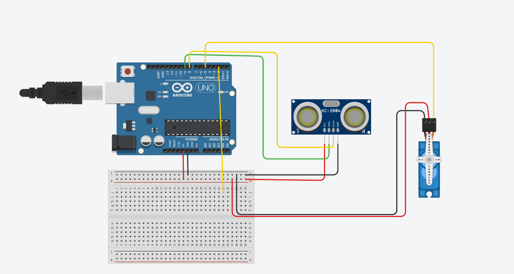

# Smart Dustbin using Arduino

This project is an **automatic smart dustbin** that opens its lid when a hand is detected near the sensor.
It uses an **ultrasonic sensor** to detect motion and a **servo motor** to open and close the lid automatically, allowing **touch-free waste disposal**.

# Features

* Automatic lid opening and closing
* Touch-free waste disposal
* Ultrasonic sensor based detection
* Servo motor controlled lid
* Beginner friendly Arduino project

# Components Required

* Arduino Uno / Nano
* Ultrasonic Sensor (HC-SR04)
* Servo Motor (SG90)
* Jumper Wires
* Breadboard
* Dustbin with lid
* USB Cable

# Working Principle

1. The ultrasonic sensor continuously measures the distance in front of the dustbin.
2. When a hand is detected within a certain distance, the Arduino triggers the servo motor.
3. The servo motor rotates and opens the lid.
4. After a few seconds, the lid automatically closes.

# Circuit Diagram

Add the circuit diagram image in the **images folder** of the repository.




# 📸 Project Images

Add images of the working project.


```
# 💻 Code

The Arduino code for this project is available in the repository:

smart_dustbin.ino

Open the file in **Arduino IDE**, connect your Arduino board, and upload the code.

# Applications

* Smart homes
* Hospitals and offices
* Public sanitation systems
* Touch-free waste management


